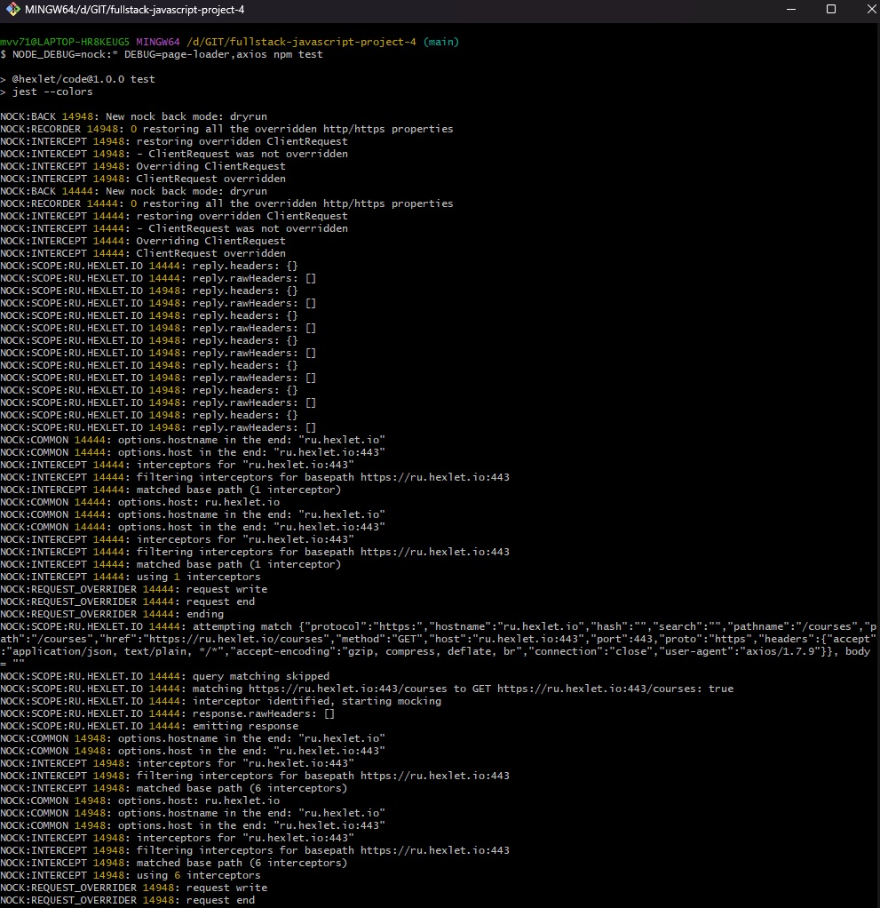
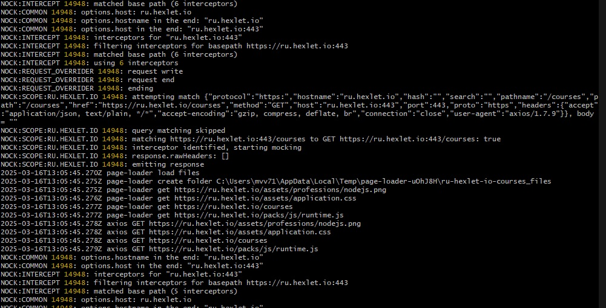
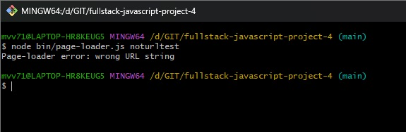

### Hexlet tests and linter status:
[](https://github.com/mvv712/fullstack-javascript-project-4/actions)
[](https://github.com/mvv712/fullstack-javascript-project-4/actions/workflows/actions.yml)
[](https://codeclimate.com/github/mvv712/fullstack-javascript-project-4/maintainability)
[](https://codeclimate.com/github/mvv712/fullstack-javascript-project-4/test_coverage)

# Проект "Загрузчик страниц"

## About
Program can download any website in html-format.
In addition, this program download all assets:
- images
- links (css of other types)
- scripts (only local)

For example:


## Installation
Clone repository
```bash
git clone https://github.com/mvv712/fullstack-javascript-project-4.git
```

## Using
```bash
node bin/page-loader.js --output folder url
make start --output folder url
```
folder - download directory ( default = process.cwd() )
url - website

For example:


## Debug
Also you can use debug for page-loader
```bash
NODE_DEBUG=nock:* DEBUG=page-loader,axios node bin/page-loader.js url
```

For example:



## Errors
Throwing errors for user on screenshot 
